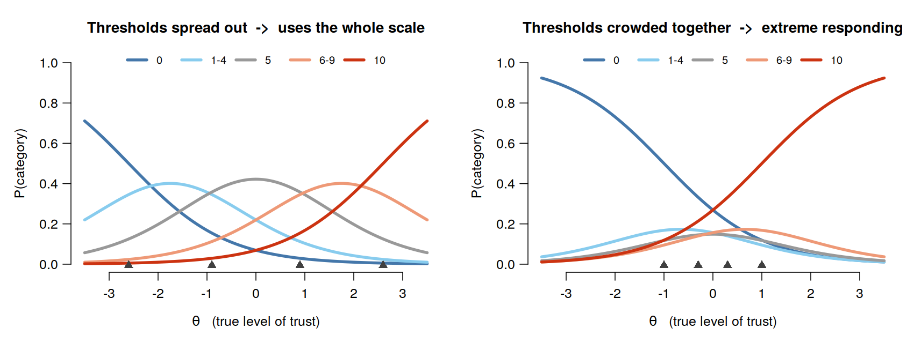

## Where we are going

1.  **Response styles** — what they are, and why you should care
2.  **Counting them** — the classical indices, and why they fail
3.  **A short IRT detour** — the machinery we need
4.  **IRTree models** — decomposing a rating into decisions
5.  **Where machine learning comes in** — partitioning, mixtures,
    clustering
6.  **Code** — the ESS institutional-trust battery, end to end

::: notes
Running example throughout: the seven ESS institutional-trust items.
Everything in the code section runs on either the real ESS file or a
simulated stand-in.
:::

# What is a response style? {background-color="#40666e"}

## Two respondents, same opinion {.smaller}

How much do you trust … *(0 = not at all, 10 = complete trust)*

| Institution         |  Anna   |  Bruno  |
|:--------------------|:-------:|:-------:|
| Parliament          |    8    |   10    |
| Legal system        |    7    |   10    |
| Police              |    8    |   10    |
| Politicians         |    6    |    5    |
| Political parties   |    6    |    5    |
| European Parliament |    7    |   10    |
| United Nations      |    8    |   10    |
| **Mean**            | **7.1** | **8.6** |

Is Bruno really more trusting? Or does he just *use the scale
differently*?

## The definition

> A **response style** is a systematic tendency to use the response
> categories of a rating scale in a particular way, **independently of
> the item content**.

Two claims are packed in here, and both are testable:

- **Systematic** — it recurs across items, not a one-off slip
- **Content-independent** — it would show up on a scale about anything

::: fragment
Contrast with a **response set** (situational, e.g. faking on one
questionnaire) and with **satisficing** (a shortcut taken under load).
:::

# The zoo {.smaller}

| Style | Behaviour | On a 0–10 scale |
|----|----|----|
| **ERS** | Extreme response style | Overuse of 0 and 10 |
| **MRS** | Midpoint / middle response style | Overuse of 5 |
| **ARS** | Acquiescence | Agreeing regardless of content |
| **DARS** | Disacquiescence | Disagreeing regardless of content |
| **NCR** | Non-contingent responding | Random / careless answers |
| **RR** | Response range | Narrow vs. wide use of the scale |

::: fragment
The ESS trust battery has no reverse-worded items, so **ARS is not
identified here**. This is a design problem, not a modelling problem
[@kam2016Further].
:::

## Why bother? I---Means *and* correlations move {.smaller}

**Means and rankings.** Styles shift the observed mean away from the
true one, by different amounts in different groups. Country A uses
endpoints more than country B; A now looks more trusting — or less —
depending on where its true mean sits relative to the midpoint
[@baumgartner2001Response].

**Correlations.** A style is a shared source of variance across every
item on the scale. Two scales measured on the same respondents share it,
so their correlation is **inflated** or **attenuated** depending on the
proportion of reverse-worded items and the distance of the scale mean
from the midpoint. Neither is under your control after data collection.

::: fragment
@ulitzsch2024Differences: scale-usage differences are **ubiquitous** in
cross-country comparisons and can manufacture or mask substantive
relationships. For the ESS this is not a footnote — it is the core
inferential risk of the comparative enterprise.
:::

## Why bother? II---Measurement invariance

Cross-national comparison rests on **invariance**: the same latent
construct, measured the same way, in every country.

A response style violates this at the level of **thresholds**---where
people place the cut-points between categories---while leaving the
factor loadings roughly intact.

::: fragment
This is exactly the pattern that shows up in the ESS comparability
literature [@davidov2015Comparability]. The acquiescence-modelling
tradition in European survey research [@billiet2000Modeling;
@billiet2008Testing] is the direct ancestor of what we do today.
:::

## Are response styles traits? {.smaller}

Two literatures, two answers.

::::: columns
::: {.column width="50%"}
**Yes — they are stable**

- Stable across scales within a session [@weijters2010Stability]
- Stable over **8 years** [@wetzel2016Stability]
- Correlated with education, age, culture [@he2014Unification]
:::

::: {.column width="50%"}
**No — not really**

@ames2022Measuring, three unrelated scales, same respondents:

- ERS across scales: *r* = .38 – .58
- A single shared ERS trait fits **much worse** (DIC 25,344 vs 19,911)
- 5-point items produced 25–46% extreme responses; 4-point items only 8%
:::
:::::

::: fragment
**Read this as:** styles are person × instrument, not person alone.
:::

# Counting---the Classical Baseline {background-color="#40666e"}

## The indices

Simple, transparent, computable in one line [@greenleaf1992Measuring;
@baumgartner2001Response].

``` r
ERS = proportion of responses in {0, 10}
MRS = proportion of responses equal to 5
ARS = proportion of responses in {6, ..., 10}
RR  = max(response) - min(response)   within person
```

::: fragment
Always compute these. They are the honest baseline any model has to
beat, and they catch data-collection disasters that a latent-variable
model will quietly absorb.
:::

## Problem 1---the confound {.smaller}

Run the data generator with the extremity dimension **switched off**.
Nobody in this population differs in extreme response style.

``` r
theta0 <- cbind(trust = ess$true_trust, mrs = ess$true_mrs, ers = 0)
X0     <- ess_engine(theta0)
idx0   <- style_indices(X0)

sd(idx0$ERS)                      # 0.15
cor(idx0$ERS, abs(idx0$M - 5))    # 0.23
```

::: fragment
The index produces **an SD of 0.15 of "extreme response style"** in a
population that has none. Someone who genuinely distrusts every
institution answers 0 seven times---and scores as a textbook extreme
responder.
:::

::: fragment
``` r
tapply(idx0$ERS, cut(idx0$M, quantile(idx0$M, 0:3/3), include.lowest = TRUE), mean)
#>  [0.43,3.86]  (3.86,5.43]  (5.43,9.57]
#>        0.198        0.154        0.188      <- U-shaped: both tails look "extreme"
```

**This is the whole argument for model-based approaches, in one table.**
You cannot subtract the trait out of a count, because the count *is*
partly the trait.
:::

## Problems 2 and 3

**2 — Where do you draw the line?**

``` r
idx_wide <- style_indices(X, extreme = c(0, 1, 9, 10))
cor(idx$ERS, idx_wide$ERS, method = "spearman")   # 0.64
```

A defensible alternative definition reshuffles a third of your rank
ordering.

::: fragment
**3 — No uncertainty.** Seven items give you a proportion out of seven.
There is no standard error, no shrinkage toward the mean, no way for the
estimate to say "I don't know". Every downstream analysis treats it as
measured without error.
:::

# A Short Detour into IRT {background-color="#40666e"}

## IRT in one slide: the binary case {.smaller}

The indices conflate two things. IRT gives us the vocabulary to write
them down **separately**: a person parameter **θ**, and **item
parameters** that translate θ into a response. Once you have that split,
"response style" has a natural home — it is a property of how the person
maps θ onto categories, not of θ itself.

For a yes/no item, the two-parameter logistic model:

$$P(X_{ij} = 1 \mid \theta_i) = \frac{\exp\left[a_j(\theta_i - b_j)\right]}{1 + \exp\left[a_j(\theta_i - b_j)\right]}$$

- $\theta_i$ — person $i$'s latent trait
- $b_j$ — item **difficulty** / location: the θ at which $P = .5$
- $a_j$ — item **discrimination**: how steeply the curve rises

::: fragment
That is a logistic regression where the predictor is unobserved and
estimated from the pattern of responses across items. Everything else is
bookkeeping.
:::

## From binary to ordinal: thresholds

An 11-category item needs **10 boundaries**. Two standard families:

::::: columns
::: {.column width="50%"}
**Graded response model**

Cumulative: $P(X \geq k \mid \theta)$

Each threshold $b_{jk}$ is the θ at which you become more likely than
not to answer *at least* $k$.
:::

::: {.column width="50%"}
**Partial credit model**

Adjacent: $P(X = k \mid X \in \{k-1, k\})$

Each threshold is a local comparison between neighbouring categories.
:::
:::::

::: fragment
Both are **"divide-by-total"** models: the category probability is one
exponential term divided by the sum over all categories.
:::

## The key insight {.smaller}

A response style is a difference in **threshold placement**, not in θ.
Same item, same trait — only the thresholds (▲) move.

{fig-align="center"}

Crowd them together and the endpoints swallow the scale: **extreme
responding**.

::: fragment
So: make the thresholds a **function of a second latent variable** and
you have a response-style model. That single idea generates most of the
literature.
:::

## Two families of response-style model {.smaller}

::::: columns
::: {.column width="50%"}
### Divide-by-total

Keep one equation per category, add style dimensions to it.

- Multidimensional PCM / NRM
- Random-threshold models
- **MNRM** [@bolt2009Addressing; @falk2016Flexible]

Map of the family: @henninger2020Different, @henninger2020Differenta
:::

::: {.column width="50%"}
### Sequential / tree

Break the response into a **sequence of binary decisions**, one latent
variable per decision.

- **IRTree** [@bockenholt2012Modeling; @bockenholt2017Measuring]
- @boeck2012IRTrees; @jeon2016Generalized

Tutorial comparing both: @bockenholt2017Response
:::
:::::

::: fragment
They are not rivals so much as different **stories about the response
process**. Pick the one whose story you are willing to defend.
:::

# IRTree Models {background-color="#40666e"}

## The idea, and the classic tree {.smaller}

Stop treating a rating as a single draw from an 11-category
distribution. Treat it as the **endpoint of a path** through a small
decision tree — each node a binary choice, each node with its own latent
variable [@bockenholt2017Measuring]:

```{mermaid}
%%| echo: false
%%| fig-width: 11
flowchart LR
    R([response]) --> M{"<b>M</b>: midpoint?<br/><i>θ MRS</i>"}
    M -->|yes| C3["3 · neither"]
    M -->|no| D{"<b>D</b>: agree?<br/><i>θ CONTENT</i>"}
    D -->|no| E1{"<b>E</b>: strongly?<br/><i>θ ERS</i>"}
    D -->|yes| E2{"<b>E</b>: strongly?<br/><i>θ ERS</i>"}
    E1 -->|yes| C1["1 · strongly disagree"]
    E1 -->|no| C2["2 · disagree"]
    E2 -->|no| C4["4 · agree"]
    E2 -->|yes| C5["5 · strongly agree"]
```

Five terminal nodes, three latent dimensions. Content and style are now
**separate equations with separate person parameters** — no subtracting
one from the other after the fact.

## Pseudo-items: the actual recoding

Each node becomes a **binary pseudo-item**. `NA` marks decisions the
respondent never faced — this is *structural*, not missing data.

| Response              | M     | D   | E   |
|-----------------------|-------|-----|-----|
| 1 (strongly disagree) | 0     | 0   | 1   |
| 2 (disagree)          | 0     | 0   | 0   |
| 3 (neither)           | **1** | NA  | NA  |
| 4 (agree)             | 0     | 1   | 0   |
| 5 (strongly agree)    | 0     | 1   | 1   |

::: fragment
One 5-category item becomes three binary items. Seven items become 21.
:::

## Estimation: it is just a multidimensional IRT model

Once recoded, an IRTree is a **multidimensional binary IRT model on the
pseudo-items**, with each pseudo-item loading on exactly one dimension.

Two equivalent routes:

::::: columns
::: {.column width="50%"}
**As an MIRT model** — `mirt`

``` r
spec <- mirt.model("
  MRS   = 1-7
  TRUST = 8-14
  ERS   = 15-21
  COV = MRS*TRUST, MRS*ERS, TRUST*ERS")
mirt(P, spec, itemtype = "2PL")
```
:::

::: {.column width="50%"}
**As a GLMM** — `lme4` + `irtrees`

``` r
long <- dendrify(X, mapping)
glmer(value ~ 0 + sub +
        (0 + sub | person) +
        (0 + node | item),
      long, family = binomial)
```

[@boeck2012IRTrees]
:::
:::::

## Our problem: the ESS scale has 11 points

The IRTree literature is built on **4–7 category** scales.
@pokropek2023detecting are explicit:

> "Decomposing scales with higher, and in some situations lower, numbers
> of categories is possible but requires some additional consideration
> and research on the processes behind the decomposition."

::: fragment
There is **no validated IRTree specification for an 11-point scale**. So
we make the collapse an explicit, declared modelling decision — and then
test how much it matters.
:::

## Our tree for the ESS trust items {.smaller}

Collapse first: `0` · `1–4` · `5` · `6–9` · `10` — endpoint, inner,
midpoint, inner, endpoint.

```{mermaid}
%%| echo: false
%%| fig-width: 11
flowchart LR
    R([response]) --> M{"<b>M</b>: exactly 5?<br/><i>θ MRS</i>"}
    M -->|yes| C3["5"]
    M -->|no| D{"<b>D</b>: 6 or more?<br/><i>θ TRUST</i>"}
    D -->|no| E1{"<b>E</b>: is it 0?<br/><i>θ ERS</i>"}
    D -->|yes| E2{"<b>E</b>: is it 10?<br/><i>θ ERS</i>"}
    E1 -->|yes| C1["0"]
    E1 -->|no| C2["1–4"]
    E2 -->|no| C4["6–9"]
    E2 -->|yes| C5["10"]
```

::: fragment
We throw away the distinction between 2 and 3. That is a real cost.
Declare it, and run the sensitivity check on slide 27.
:::

## Model in R

::: panel-tabset
## Data

```{r}
#| echo: true
#| message: false
library(rio)
library(tidyverse)
trust_items <- c(
  trstprl = "Country's parliament",
  trstlgl = "The legal system",
  trstplc = "The police",
  trstplt = "Politicians",
  trstprt = "Political parties",
  trstep  = "The European Parliament",
  trstun  = "The United Nations"
)

ess <- import("../data/ESS11e04_2.sav")

wanted <- c("idno", "cntry", "agea", "gndr", "eduyrs", "pspwght", "anweight",
            names(trust_items))
keep   <- intersect(wanted, names(ess))
```

## Recode

```{r}
collapse5 <- function(X) {
  out <- X
  out[X == 0]          <- 1L   # endpoint low
  out[X >= 1 & X <= 4] <- 2L   # inner low
  out[X == 5]          <- 3L   # midpoint
  out[X >= 6 & X <= 9] <- 4L   # inner high
  out[X == 10]         <- 5L   # endpoint high
  storage.mode(out) <- "integer"
  out
}
Xc <- collapse5(X)
table(Xc)                       # all five categories must be non-empty
stopifnot(length(unique(as.vector(Xc))) == 5)


```

## Results
:::

## Caveat 1 — recovery degrades down the tree

@alarcon2023Monte, Monte Carlo, 5-point MPP tree, N = 500–5,000, 10–20
items:

| Node            | Mean RMSE (discrimination) | Mean RMSE (difficulty) |
|-----------------|----------------------------|------------------------|
| Midpoint (1st)  | 0.13                       | 0.09                   |
| Agreement (2nd) | 0.42                       | 0.93                   |
| Extreme (3rd)   | **0.94**                   | **3.13**               |

::: fragment
"Node" accounted for **81%** of the variance in difficulty RMSE — sample
size for essentially none. Yet reported standard errors stayed at
0.00–0.03.

**The model looks confident while being badly wrong at the deepest
node.**
:::

## Caveat 2 — not everyone runs the same process

@kim2021Mixture fit a **mixture** IRTree: some respondents' extreme
answers reflect a style, others' reflect a genuinely extreme opinion.

- TIMSS application: **32% ERS class, 68% ordinal class**
- A single-class model's 95% credible intervals covered the truth only
  **68.8%** of the time — badly overconfident

::: fragment
@merhof2023Dynamic push further: the process invoked can vary *within*
person across nodes. @merhof2024Separation show trait and ERS estimates
can **mimic** each other, which is a direct threat to interpreting
either.
:::

## Caveat 3 — item-specific factors

@lyu2023Exploring: sequential/IRTree models assume the stages within an
item are conditionally independent given θ. If there is an
**item-specific person factor** η that persists across stages, that
assumption fails.

- With sd(η) = 2, estimated discrimination fell from 2.00 at stage 1 to
  **0.38** at stage 4 — with *constant* true parameters
- Empirically, TIMSS maths: mean $a_1$ = 1.75 vs $a_2$ = 0.96

::: fragment
The declining-discrimination pattern you see across nodes may be an
artefact of the model, not a finding about the response process.
:::

## Where this leaves us

::: callout-warning
## The honest summary of five papers

All five converge on one point: **IRTree models assume a homogeneous,
node-invariant response process, and that assumption is fragile.**

- @lyu2023Exploring — unmodelled item-specific factors distort node
  parameters
- @kim2021Mixture, @debelak2025Investigating — the process differs
  across people
- @ames2022Measuring — styles are not even stable across scales for one
  person
- @alarcon2023Monte — deep nodes are intrinsically noisy regardless
:::

::: fragment
This is not a reason to abandon IRTree. It is a reason to **test the
assumption** — which is precisely where machine learning earns its keep.
:::

# Where Machine Learning Comes In {background-color="#40666e"}

## Three distinct jobs {.smaller}

"ML for response styles" covers three genuinely different things. Keep them apart.

| Job | Question | Method |
|---|---|---|
| **Partitioning** | *Who* runs a different process? | Mixture of Bidders (MOB), score-based trees |
| **Mixtures** | How many processes are there? | Latent class, mixture IRT |
| **Description** | What does scale use look like? | Clustering, anomaly detection |

::: {.fragment}
Only the first two are inferential. The third is exploratory---useful, but it
identifies nothing on its own.
:::

## ## Job 1 — Recursive partitioning over people {.smaller}

You already know CART. **Model-based recursive partitioning**
[@zeileis2008Model] swaps the constant in each leaf for a **fitted model**:

1. Fit the measurement model to everyone
2. Compute each respondent's **score contribution** (gradient of the log-likelihood)
3. Order respondents by a covariate; test whether the cumulative scores drift
4. If they do, split at the covariate value that maximises the split likelihood
5. Recurse

::: {.fragment}
The split criterion is a **parameter-instability test** [@merkle2013Tests], not
impurity. That is the whole difference — and it is what makes the tree interpretable
as "these two groups measure differently".
:::

## Job 1 — in psychometrics {.smaller}

- `raschtree` — DIF in the Rasch model without pre-specified groups [@strobl2015Rasch]
- `pctree` — the polytomous extension [@komboz2018Tree]
- The general R toolbox: @schneider2021Toolbox

::: {.fragment}
@debelak2025Investigating apply exactly this **to a response-style IRTree**. Employee
survey, N = 3,964, covariate = job tenure:

- Trait loading on the non-moderate node: **α = .761** overall
- Heterogeneity test significant for α^nm (*p* = .007), **not** for α^e (*p* = .961)
- Split at 5 years of service; shorter-tenure staff respond more trait-driven
:::

::: {.fragment}
::: {.callout-caution}
## And the warning that comes with it
A split has **two** readings: **(a)** the groups run a different response process, or
**(b)** they simply differ in the *level* of the latent trait. These are confusable.
Their check: re-fit with the group mean freed in only one group and see whether the
loading difference survives. A tree will happily split on either — it does not know
which story you meant.
:::
:::


## References
